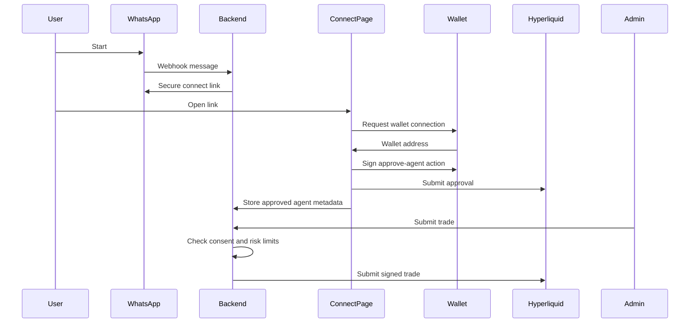

# Architecture

## Components

- WhatsApp webhook: receives incoming user messages and sends onboarding links.
- Connect web app: lets the user connect an EVM wallet and approve a Hyperliquid API wallet.
- Hyperliquid adapter: wraps info and exchange endpoints.
- Consent service: enforces user approval, scope, expiry, and risk limits before any trade.
- Admin API: lets an operator or strategy submit trades for approved users.
- Credential vault: stores API-wallet secrets encrypted at rest.

## Consent and delegation

The admin should only operate through Hyperliquid API wallets. Hyperliquid describes these as agent wallets that sign for a master account or sub-account. This keeps the user's main wallet key outside the backend and makes revocation possible.

The system should store:

- User wallet address.
- Approved agent wallet address.
- Encrypted agent private key only if the product chooses server-side signing.
- Consent scope, expiry, and risk limits.
- Audit log of every admin action.

## Onboarding sequence

## Funding

Funding should stay user-controlled. The WhatsApp agent can:

- Explain deposit steps.
- Generate a link to the user's Hyperliquid deposit flow.
- Poll account state and notify once funds are visible.

It should not ask the user to send funds to an admin wallet.
